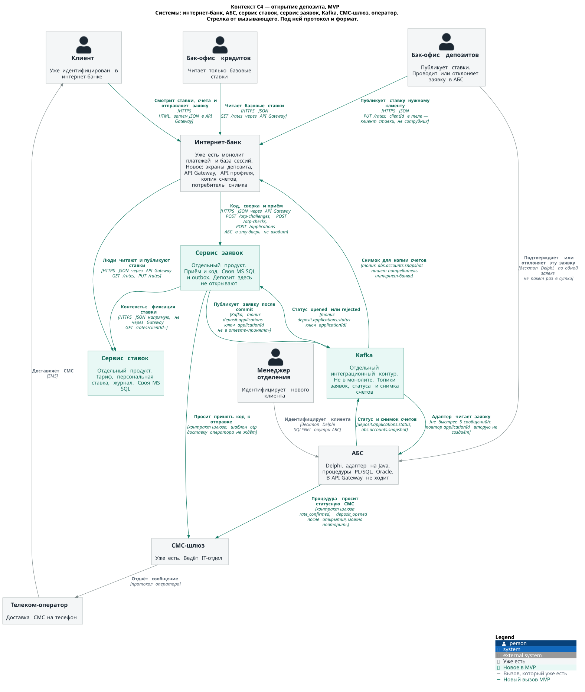
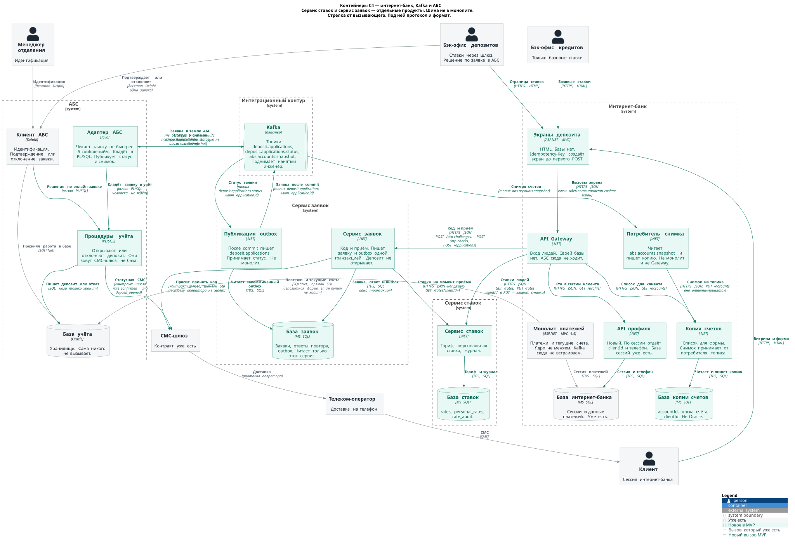
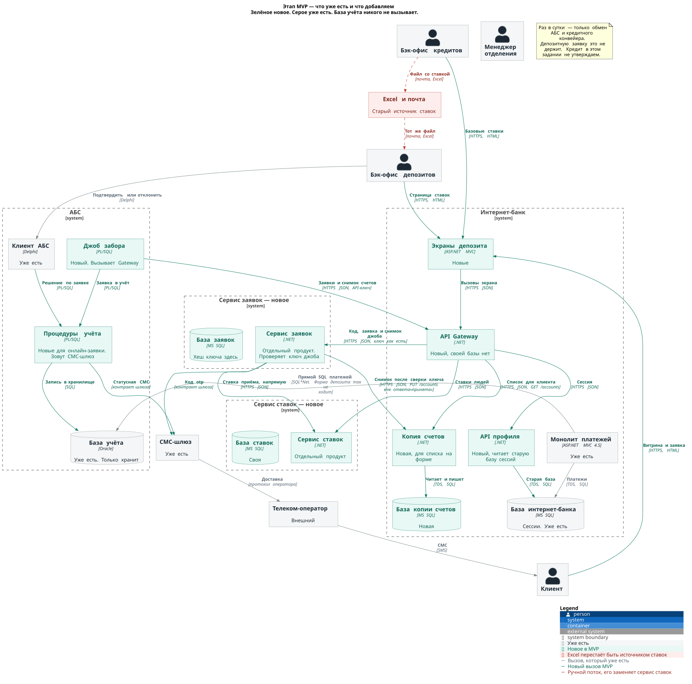
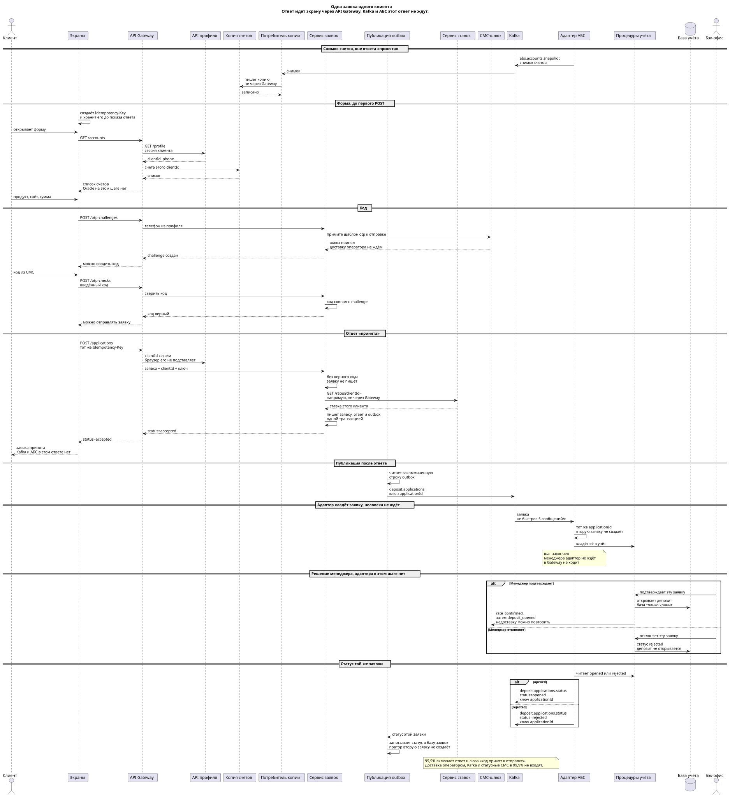

# ADR. Открытие депозита онлайн, MVP

### Название задачи:

STD-ADR-3. Концептуальная архитектура открытия депозита и накопительного счёта в интернет-банке, MVP

### Автор:

d.karpov

### Дата:

03.10.2026

### Функциональные требования

Основной поток MVP. Горизонт — шесть месяцев: клиент интернет-банка отправляет заявку, бэк-офис проводит её в АБС. Год без бэк-офиса в эти сценарии не входит. Особые условия кол-центра остаются в сегодняшнем процессе отделения: в онлайн-заявке ставка берётся из сервиса. Сайт, кол-центр и кредит на этом этапе новых вызовов не получают.

| **№** | **Действующие лица или системы** | **Use Case** | **Описание** |
| :-: | :- | :- | :- |
| UC1 | Клиент, экраны, API Gateway, профиль, ставки | Витрина ставок | 1. Клиент открывает экран депозита. Экран в базы не ходит. 2. Экран вызывает API Gateway: HTTPS JSON, GET /rates. 3. Gateway по сессии спрашивает профиль: GET /profile, забирает clientId. 4. Gateway читает контекст ставок. 5. Клиент видит базовую и персональную ставку. F5, F10. |
| UC2 | Клиент, экраны, API Gateway, профиль, копия счетов, заявка, ставки, СМС-шлюз | Заявка на депозит или накопительный счёт | 1. Экран до первого POST создаёт Idempotency-Key и хранит его, пока клиент не увидел ответ. 2. Список счетов экран берёт через Gateway из копии счетов. Oracle на этом шаге не читается. Снимок кладёт отдельный вызов: джоб, Gateway, сервис заявок сверяет ключ и пишет копию. Не этот запрос. 3. Клиент выбирает продукт, счёт и сумму. 4. Экран вызывает POST /otp-challenges. Gateway берёт телефон у профиля. 5. Сервис заявок просит СМС-шлюз принять код к отправке и не ждёт, пока оператор доставит SMS. 6. Клиент вводит код. Экран через Gateway просит сервис заявок сверить код. Неверный код заявку не создаёт. 7. После верного кода экран шлёт POST /applications с тем же ключом. 8. Для этой сессии Gateway подставляет clientId из профиля. 9. Сервис заявок сам, напрямую, читает ставку у сервиса ставок и пишет заявку. Ответ accepted возвращается клиенту через Gateway и экран. 10. АБС в этом ответе не участвует. Ключ защищает повтор из браузера. Сквозной идентификатор между сайтом, кол-центром и отделением появится вместе с заявкой с сайта, не в этом MVP. F6, F8. |
| UC3 | Бэк-офис депозитов, джоб, процедуры учёта, API Gateway, заявка | Подтверждение или отклонение | 1. Джоб раз в несколько минут вызывает Gateway с API-ключом. Ключ сверяет сервис заявок по хешу в своей базе, не Gateway. 2. Джоб кладёт заявку в учёт и на этом заходе человека не ждёт. 3. Менеджер в Delphi либо подтверждает условия, либо отклоняет заявку. 4. При подтверждении процедура открывает депозит в базе учёта и сама просит статусные СМС. При отклонении депозит не открывается, в базе пишется rejected. 5. Следующим заходом джоб читает opened или rejected и шлёт ack с тем же applicationId. Повтор джоба вторую заявку не создаёт. F7. |
| UC4 | Процедуры учёта, СМС-шлюз, оператор, клиент | Статусные СМС | 1. После подтверждения процедура, не база, просит у шлюза шаблон rate_confirmed. 2. После открытия — шаблон deposit_opened. 3. Шлюз отдаёт сообщение оператору. 4. Недоставка не отменяет уже открытый депозит, процедуру можно повторить. Это не код подтверждения из UC2. F9. |
| UC5 | Бэк-офис депозитов, бэк-офис кредитов, экраны, API Gateway, ставки | Ведение ставок | 1. Бэк-офис депозитов открывает страницу ставок. 2. PUT /rates несёт product, rate и clientId того клиента, которому ставят персональную ставку. Gateway не подменяет этот clientId на сотрудника. author Gateway берёт из сессии сотрудника. 3. Роль депозитов может публиковать, роль кредитов — только GET /rates без списка клиентов. F10, S5. |
| UC6 | Клиент, менеджер отделения, АБС | Идентификация нового клиента | 1. Новый клиент приходит в отделение лично. 2. Менеджер идентифицирует его в Delphi, данные уходят в Oracle по SQL*Net. 3. Сайт и интернет-банк учётную запись без этого визита не создают. F4. |

### Нефункциональные требования

В таблицу попали требования, которые меняют контейнеры и вызовы. Удобство экрана и кредитные ограничения сюда не входят.

| **№** | **Требование** |
| :-: | :- |
| R1 | Приём заявки доступен 24/7. Проведение в АБС в этот режим не входит. |
| R2 | Доступность приёма заявки 99,9%. Считается по ответу «заявка принята», не по живости сервера и не по АБС. |
| R3 | При сбое основного ЦОД приём заявки продолжается в резервном. |
| P1 | Витрина и ответ «заявка принята» укладываются в миллисекунды. АБС в этот предел не входит. |
| P3 | Контур приёма заявки масштабируется горизонтально. АБС остаётся вертикальной. |
| S1 | Новый продукт садится на контур заявки и читает ставки из сервиса. Прямой доступ к базе АБС для этого не открываем. На год бэк-офис уходит из проведения, источник ставок остаётся тем же. |
| S2 | Сервис ставок, сервис заявок и экраны пишет команда банка. Ядро интернет-банка и СМС внутри ядра подрядчику не отдаём. |
| S5 | Смена ставки пишется в журнал: кто, когда, какое значение. |
| S6 | Контур заявки выкатывается отдельно от платежей. Сбой заявки платежи не останавливает. |
| +R1 | Сервисы контура на .NET, базы на MS SQL. АБС остаётся на Oracle и PL/SQL. Новый язык не вводим. |
| +R2 | Kafka в монолит не встраиваем и шину на контуре не поднимаем: экспертизы в ландшафте нет. |
| +R4 | Веб-приложение на приёме заявки не вызывает API АБС и не читает её базу. Ответ «принята» приходит из сервиса заявок. Повтор с тем же applicationId вторую заявку не создаёт. |
| +R5 | Каналы, где едут телефон, счёт или clientId, работают по TLS. |
| +R7 | Код и статусные СМС идут через существующий шлюз IT-отдела. |
| +R9 | Бэк-офис кредитов не видит клиентов депозитов. Общий объект двух бэк-офисов — базовые ставки. |

### Решение

Депозит разрезан на ограниченные контексты. Внутри контекста одно слово значит одно. Слово «заявка» живёт в контексте заявки. Слово «депозит» — только в учёте АБС. Слово «ставка» — только в контексте ставок. Общей базы на всех нет: наружу контекст отдаёт HTTPS JSON, свою базу читает сам.

На контексте интернет-банк — одна система. Внутри него на контейнерах лежат монолит платежей, его MS SQL, новые экраны депозита, API Gateway, новый API профиля и копия счетов. Сервис ставок и сервис заявок — отдельные продукты со своими базами, не контейнеры монолита.

Для людей и джоба учёта дверь одна: API Gateway. Между сервисом заявок и сервисом ставок вызов прямой, Gateway в нём не стоит. У Gateway своей базы нет, поэтому API-ключ джоба он не проверяет: передаёт заголовок сервису заявок, а хеш ключа лежит и сверяется только в базе заявок. Снимок счетов идёт тем же путём. Шлюз не пишет его в копию сам.

Экран в базы не ходит. Список счетов для UC2 он читает через Gateway из копии счетов. Копию наполняет другой вызов, вне ответа «принята»: джоб отдаёт `PUT /accounts` в Gateway, Gateway передаёт его сервису заявок, сервис сверяет ключ и сам пишет снимок в копию. Форма в Oracle не смотрит. Монолит платежей по-прежнему ходит в Oracle прямым SQL, и эта стрелка на контейнерах есть. Депозитная форма её не использует.

API профиля новый. В кейсе у монолита такого API нет. База сессий интернет-банка уже есть, новый API только читает её.

Код и статусные СМС разделены. Код обязателен до «принята»: сервис заявок ждёт, что СМС-шлюз принял сообщение к отправке. Доставку оператором на телефон этот шаг не ждёт. Если шлюз молчит и цепь разомкнута, до «принята» клиент не доходит, и это входит в 99,9% приёма. Статусную СМС после открытия шлёт процедура учёта, не база Oracle. Её недоставка депозит не отменяет, и в 99,9% она не входит.

Так закрываются 24/7 и 99,9% на приёме заявки, горизонтальный масштаб и отдельная выкладка. Учёт остаётся вертикальным.

Команды. Экраны, API Gateway, ставки и заявку делает команда интернет-банка внутри банка, 10 человек. API профиля — чтение уже существующей сессии, его же команда, ядро и СМС в ядре подрядчику не отдаём. Джоб забора, проведение и статусные СМС делает команда АБС, 20 человек. СМС-шлюз остаётся у IT-отдела. Бэк-офис депозитов публикует ставки через Gateway и проводит депозит в Delphi. Бэк-офис кредитов через Gateway читает базовые ставки и клиентов депозитов не получает. Подрядчик интернет-банка, кол-центр и команда трансформации этот контур не разрабатывают.

#### Кто кого вызывает

Стрелка на схемах идёт от вызывающего. Вторая строка — протокол и формат.

| Кто вызывает | Кого | Протокол и формат | Что в теле | Чей это контекст |
| --- | --- | --- | --- | --- |
| Клиент, бэк-офис | Экраны депозита | HTTPS, HTML | Витрина, форма, страница ставок | Интернет-банк, у экрана базы нет |
| Экраны депозита | API Gateway | HTTPS JSON | Вызовы экрана. Idempotency-Key создал экран. clientId клиента из браузера не принимается | Интернет-банк |
| API Gateway | API профиля | HTTPS JSON, GET /profile | Сессия клиента → clientId, phone | Интернет-банк. API новый |
| API профиля | База интернет-банка | TDS, SQL | Сессия и телефон. База уже есть | Интернет-банк |
| API Gateway | Копия счетов | HTTPS JSON, GET /accounts | Список счетов сессии. Ответ возвращается на экран через Gateway. Не Oracle | Интернет-банк |
| Джоб учёта | API Gateway | HTTPS JSON, PUT /accounts, API-ключ | Снимок счетов, вне ответа «принята» | АБС отдаёт, шлюз не хранит и ключ не сверяет |
| API Gateway | Сервис заявок | HTTPS JSON, PUT /accounts | Снимок и ключ как есть | Дверь джоба |
| Сервис заявок | Копия счетов | HTTPS JSON, PUT /accounts | Запись снимка после сверки хеша. Напрямую, не через шлюз | Хеш только в базе заявок |
| API Gateway | Сервис ставок | HTTPS JSON, GET /rates и PUT /rates | PUT: clientId — клиент, которому ставят ставку. author — сотрудник из сессии | Люди через дверь Gateway |
| API Gateway | Сервис заявок | HTTPS JSON, POST /otp-challenges, POST /otp-checks, POST /applications | Код, сверка введённого кода, приём, забор. Неверный код заявку не создаёт. Ключ джоба Gateway не проверяет | Дверь для людей и джоба |
| Сервис ставок | База ставок | TDS, SQL | rates, personal_rates, rate_audit | Ставки, только своя база |
| Сервис заявок | Сервис ставок | HTTPS JSON, GET /rates?clientId= | Ставка на момент приёма | Прямой вызов контекстов, не через Gateway |
| Сервис заявок | База заявок | TDS, SQL | Заявка, сохранённый ответ, хеш API-ключа | Только сервис заявок |
| Сервис заявок | СМС-шлюз | Контракт шлюза | Шаблон otp. Ждём «принято к отправке», не доставку | Код, входит в путь «принята» |
| Джоб учёта | API Gateway | HTTPS JSON и API-ключ | GET принятых и POST ack | Ключ проверяет сервис заявок |
| Джоб учёта | Процедуры учёта | Вызов PL/SQL | Сначала кладёт заявку и уходит. Следующим заходом читает opened или rejected | АБС |
| Клиент АБС | Процедуры учёта | Вызов PL/SQL | Подтверждение или отклонение | АБС |
| Процедуры учёта | База учёта | SQL | Депозит или статус rejected. База никого не вызывает | АБС |
| Процедуры учёта | СМС-шлюз | Контракт шлюза | rate_confirmed, deposit_opened | Статусные СМС, после открытия |
| СМС-шлюз | Телеком-оператор | Протокол оператора | Сообщение на доставку | Внешний |
| Телеком-оператор | Клиент | SMS | Текст кода или статуса | Внешний |
| Монолит платежей | База учёта | SQL*Net, прямой SQL | Платежи и текущие счета | Старый контекст платежей. Депозит так не ходит |
| Бэк-офис кредитов | Excel и почта | Письмо с Excel, раз в сутки | Расчёт ставки | Уходит, вместо него контекст ставок |

Контракт шлюза в кейсе не назван. Новые вызовы идут тем контрактом, которым АБС пользуется уже сейчас. Второй протокол к оператору не проектируем.

clientId клиента в заявку подставляет Gateway из профиля. clientId в PUT /rates — это клиент персональной ставки, его присылает бэк-офис, и Gateway на сотрудника его не меняет. Экран, Gateway, ставки и заявка базу учёта в ответе «принята» не читают.

Джоб забирает каждую принятую заявку отдельно, раз в несколько минут. Менеджер в Delphi подтверждает эту заявку и открывает депозит этому клиенту. Раз в сутки ходят базы АБС и кредитного конвейера. Это чужой процесс кредита. Заявку на депозит он не задерживает, и кредит в этом задании никому не утверждается.

#### Паттерны на вызовах

Берём то, без чего теряется заявка или встаёт приём. Остальное на этом этапе не ставим: каждый паттерн стоит отдельного процесса.

Идемпотентность. Ключ создаёт экран до первого POST и шлёт его снова, если ответ потерялся. Первый запрос пишет заявку и готовый ответ одной транзакцией. Повтор с тем же ключом и тем же телом возвращает сохранённый ответ. Тот же ключ с другой суммой даёт 409. Это защита повтора из браузера и повтора джоба. Одна заявка на сайт, кол-центр и отделение — не этот ключ: общий идентификатор каналов появится с заявкой с сайта.

Retry с паузой. Повторяем только временный сбой шлюза и временный сбой, когда джоб не дозвался до сервиса заявок. Пауза растёт, залпа из всех экземпляров нет. Ошибка в данных повтором не лечится.

Circuit breaker на коде. Стоит в сервисе заявок на вызове СМС-шлюза за шаблоном otp. Шлюз молчит — цепь размыкается, до «принята» клиент не доходит, и этот отказ входит в 99,9% приёма. Доставку оператором на телефон цепь не ждёт: шлюз ответил «принято к отправке», клиент вводит код следующим запросом. Платежи в это время идут в другом процессе.

Bulkhead. Сервис заявок, его база и пул потоков отдельные от монолита. Медленный SQL платежей в Oracle не занимает приём заявки.

Graceful degradation. Ядро UC2 — ответ «принята» после верного кода. Код и запись заявки заглушкой не подменяем. Витрина при молчащем сервисе ставок показывает ошибку экрана, а не вчерашнюю ставку. Статусная СМС — не ядро: депозит уже открыт, недоставка его не отменяет.

Health check. У Gateway, ставок и заявки две пробы. /health/live отвечает, жив ли процесс. /health/ready у ставок и заявки отвечает, доступна ли своя MS SQL. У Gateway своей базы нет, ready означает, что процесс принимает маршруты. Балансировщик снимает трафик по ready. 99,9% считаем по ответу «принята», не по этим пробам.

API Gateway. Для людей и для джоба учёта это единственная дверь к ставкам и заявке. Роль проверяется здесь: депозиты публикуют ставку, кредиты только читают базовые. Прямой вызов сервиса заявок в сервис ставок — между контекстами, не через эту дверь. API-ключ джоба Gateway не проверяет и не хранит: хеш лежит в базе заявок, сверяет его сервис заявок. Это же место проверяет ключ на `PUT /accounts`, потому что снимок приходит в сервис заявок, и уже оттуда пишется в копию. Копия ключ не хранит. Браузер ключ не видит.

Совместимость контракта. Поля JSON только добавляем. applicationId, status и rate не меняют смысл между релизами веба, сервиса заявок и джоба. Сначала перестаёт читать старая сторона, потом перестаём писать.

Метрики и traceId. Сервис заявок отдаёт /metrics, в том числе счётчик ответов «принята». Отдельный контур мониторинга в ландшафт не добавляем. traceId рождается на API Gateway и едет в профиль, ставки, заявку и СМС-шлюз. По нему склеивается путь одной заявки.

На этом этапе не ставим. Шина, transactional outbox в брокер, inbox-топик и очередь недоставленных сообщений: шины нет, надёжная точка — закоммиченная строка заявки, которую АБС читает сама. Saga-оркестратор: между «принята» и проведением сидит человек в АБС, повтор забора сходится без компенсации двух баз. Service discovery и sidecar: адресов два, отдельного кластерного реестра в кейсе нет. Ограничение частоты на анонимный вход: заявку шлёт уже открытая сессия интернет-банка.

#### Схемы

Исходники лежат рядом с этим ADR, в `Task3/c4`. SVG собирает GitHub Actions из этих файлов и кладёт туда же.

Контекст. Люди и системы: интернет-банк, АБС, сервис ставок, сервис заявок, СМС-шлюз, оператор. Ставки и заявка — отдельные продукты. Базы на этом уровне не нарисованы.

Контейнеры. Разобраны интернет-банк и АБС. В интернет-банке — монолит платежей, его MS SQL, новый API профиля, экраны, API Gateway и копия счетов. Список для клиента идёт от Gateway в копию. Снимок джоба Gateway только передаёт в сервис заявок, а в копию его пишет уже сервис заявок после сверки ключа. В АБС — Delphi, джоб, процедуры учёта и база, которая никого не вызывает. Статусную СМС рисует процедура. Сервис ставок и сервис заявок стоят отдельными системами.

Этап. Зелёное — новое внутри интернет-банка, ставки и заявка. Серое — уже есть: платежи, база сессий, АБС. Красный пунктир — Excel. Страница ставок нарисована у обоих бэк-офисов. Серая стрелка прямого SQL — только монолит платежей в чужую базу учёта.

Одна заявка. На последовательности есть снимок счетов вне «принята», ключ экрана, профиль, список счетов через Gateway, проверка кода, прямая фиксация ставки и ответ через Gateway и экран. Джоб сначала кладёт заявку и уходит. Подтверждение или отклонение идёт без него. Ack — следующий заход. Сутки на этой схеме не участвуют.

### Альтернативы

Экран депозита читает базы сам, как сегодня монолит платежей читает Oracle. Тогда у канала появляется чужая модель и чужая база, а API Gateway нечем защищать роль и ключ. Прямой SQL оставляем в контексте платежей и за пределы этого контекста не несём.

Заявка внутри монолита и запись в базу учёта тем же SQL*Net, что платежи. Монолит и так один на группу серверов, ядро меняет подрядчик, учёт масштабируется только вертикально. Ответ «принята» тогда ждал бы Oracle, и 99,9% легли бы на систему, которая этот процент не держит.

Шина Kafka между сервисом заявок и АБС. Монолит с Kafka не стыкуется, отдельной экспертизы шины в ландшафте нет. Забор закоммиченных строк джобом даёт ту же доставку «хотя бы один раз» без нового продукта.

Суточный обмен базами, как у кредитного конвейера. Для кредита чаще суток нельзя. Для депозита такого запрета нет, а клиенту ответ нужен сразу. Сутки в очереди бэк-офиса здесь ничем не оплачены.

Сразу автоматическое открытие без бэк-офиса. Это цель года. На MVP условие по-прежнему подтверждает человек в АБС. Сервис ставок при этом уже стоит отдельно, чтобы на год убрать человека и не переносить источник ставок.

### Недостатки, ограничения, риски

Бэк-офис депозитов работает в двух местах: ставку публикует в сервисе, заявку проводит в Delphi. Это цена того, что Excel уходит сейчас, а человек из проведения уходит на горизонте года.

Между ответом «принята» и депозитом в АБС проходит интервал джоба, несколько минут. Клиент в это время видит принятую заявку, а не открытый счёт. Если джоб встанет, заявки копятся в MS SQL и не теряются.

Копия счетов отстаёт на тот же интервал джоба. Сумму на счёте при приёме заявки не проверяем: это сделает бэк-офис при проведении.

Персональную ставку на MVP по-прежнему задаёт человек. Сервис её хранит и журналирует, из Oracle на каждый просмотр витрины не вычисляет.

Протокол шлюза в кейсе не назван. Если он не похож на HTTP, сервис заявок подстраивается под уже принятый контракт АБС, а не заводит второй.

Монолит платежей остаётся в одном ЦОД. Резервный ЦОД и горизонтальный масштаб относятся к сервису заявок и сервису ставок.

99,9% считается по ответу «заявка принята». В этот путь входит ответ СМС-шлюза, что код принят к отправке: без него клиент до «принята» не доходит. В 99,9% не входят доставка SMS оператором, статусные СМС после открытия и проведение в АБС. Пробы /health эту метрику не подменяют.
