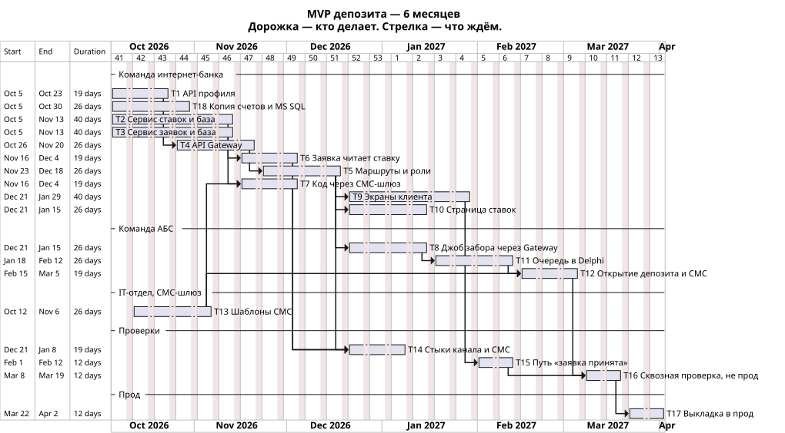

# План MVP депозита на 6 месяцев

Горизонт — полгода из [ADR](ADR.md). Клиент получает «заявка принята» сразу. Бэк-офис подтверждает каждую заявку в АБС и открывает депозит. Кредит и суточный обмен с конвейером в этот план не входят.

Длительность укрупнённая: команды потом режут эпики на свои задачи. Сроки ниже — порядок и зависимости, не оценка менеджера проекта.

Старт плана: 5 октября 2026. Конец горизонта: начало апреля 2027.

## Этапы

1. **Месяцы 1–2.** Свои базы и каркас входа. Профиль отдаёт сессию по API. Ставки, заявка и копия счетов поднимаются со своими MS SQL. У шлюза появляются шаблоны СМС.
2. **Месяцы 2–4.** Стыки. API Gateway маршрутизирует вызовы и не открывает чужие базы. Заявка читает ставку по HTTPS. Джоб учёта начинает забирать заявки.
3. **Месяцы 4–6.** Экран клиента, очередь в Delphi, открытие депозита одной заявке, СМС статуса и проверки этой цепочки.

## Задачи

| Номер | Задача | Система | Команда |
| --- | --- | --- | --- |
| T1 | Новый API профиля поверх уже существующей базы сессий: по сессии отдаёт clientId и телефон | Интернет-банк | Интернет-банк, 10 человек внутри банка |
| T2 | Сервис ставок и его MS SQL: тариф, персональная ставка, журнал кто-когда-значение | Ставки | Интернет-банк |
| T3 | Сервис заявок и его MS SQL: приём, Idempotency-Key, сохранённый ответ повтора | Заявка | Интернет-банк |
| T4 | API Gateway: TLS, маршруты, пробы /health/live и /health/ready. Своей базы нет | Канал депозита | Интернет-банк |
| T5 | Маршруты Gateway: роли бэк-офиса. clientId клиента в заявку подставляет шлюз из сессии. В PUT /rates clientId из тела не подменяет. Ключ джоба не проверяет | Интернет-банк | Интернет-банк |
| T6 | В момент приёма заявка спрашивает ставку по HTTPS и записывает её у себя | Заявка, ставки | Интернет-банк |
| T7 | Код подтверждения до ответа «принята»: сервис заявок вызывает существующий СМС-шлюз и сверяет введённый код до записи заявки | Заявка, СМС-шлюз | Интернет-банк |
| T8 | Джоб учёта раз в несколько минут вызывает Gateway: забирает заявки и отдельным вызовом отдаёт снимок счетов. Снимок принимает сервис заявок, сверяет ключ и пишет копию. Это не шаг ответа «принята» | АБС | АБС, 20 человек |
| T9 | Экраны витрины и формы. Экран создаёт Idempotency-Key до первого POST. Список счетов берёт через Gateway из копии, не из Oracle | Интернет-банк | Интернет-банк |
| T10 | Страница ставок для бэк-офиса: депозиты публикуют, кредиты читают базовые без клиентов | Канал депозита, ставки | Интернет-банк |
| T11 | Очередь в Delphi: менеджер подтверждает эту заявку, не пакет раз в сутки | Учёт депозита | АБС |
| T12 | Процедура учёта открывает или отклоняет депозит и сама просит статусные СМС. База Oracle никого не вызывает | АБС, СМС-шлюз | АБС |
| T13 | Шаблоны otp, rate_confirmed и deposit_opened на уже существующем шлюзе. Новый канал к оператору не открываем | СМС-шлюз | IT-отдел |
| T14 | Интеграционные проверки стыков: Gateway → профиль, ставки и заявка; заявка → СМС-шлюз; повтор с тем же Idempotency-Key не создаёт вторую заявку. Внутренности АБС и ядра не проверяем | Канал, заявка, СМС-шлюз | Интернет-банк |
| T15 | Проверка сценария «клиент отправил заявку и получил ответ, что она принята». По этому пути потом считают 99,9% | Канал, заявка | Интернет-банк |
| T16 | Сквозная проверка одной заявки на стенде: джоб забрал, менеджер подтвердил в Delphi, депозит открыт, СМС статуса ушло, повтор не открыл второй. Это ещё не прод | Заявка, учёт, СМС-шлюз | Интернет-банк и АБС |
| T17 | Выкладка в прод: экраны, API Gateway, ставки, заявка, копия счетов, джоб учёта и шаблоны СМС. Клиент в интернет-банке отправляет боевую заявку | Канал, ставки, заявка, учёт | Интернет-банк и АБС |
| T18 | Копия счетов и её MS SQL. Список сессии отдаёт через Gateway. Снимок принимает от сервиса заявок и ключ не проверяет. В ответе «принята» не участвует | Интернет-банк | Интернет-банк, 10 человек |

Подрядчик интернет-банка эти задачи не берёт: ядро платежей и СМС внутри ядра не меняем. Бэк-офис депозитов и кредитов — пользователи T10, T11 и T12, не разработчики.

## Кто от кого зависит

- T5 ждёт T1, T2, T3 и T4: маршрутизировать некуда, пока нет профиля, ставок, заявки и шлюза.
- T6 ждёт T2 и T3.
- T7 ждёт T3 и T13.
- T8 ждёт T5 и T18: джоб входит только через Gateway, а снимок некуда класть, пока нет копии.
- T9 ждёт T5 и T18: экран читает список из копии.
- T10 ждёт T5.
- T11 ждёт T8: в Delphi нечего подтверждать, пока заявка не легла в учёт.
- T12 ждёт T11 и T13.
- T14 ждёт T5, T6 и T7: стыки проверяем, когда маршруты, ставка и код уже стоят.
- T15 ждёт T9 и T14: путь «заявка принята» идёт через экран.
- T16 ждёт T12 и T15: сквозную проверку начинаем, когда открытие депозита и путь «заявка принята» уже собраны. Идёт две недели, примерно 8–19 марта 2027. В прод этой задачей ничего не выкладываем.
- T17 ждёт T16. Выкладка в прод — 22 марта–2 апреля 2027. Пока T16 не пройдена, боевую заявку клиенту не открываем.

## Роадмап

Дорожки — команды. Столбик времени — полгода. Стрелка на диаграмме значит «эту задачу не начинаем, пока не кончилась предыдущая».

