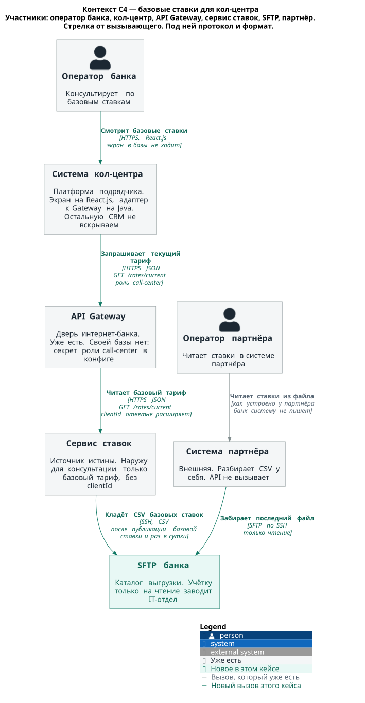
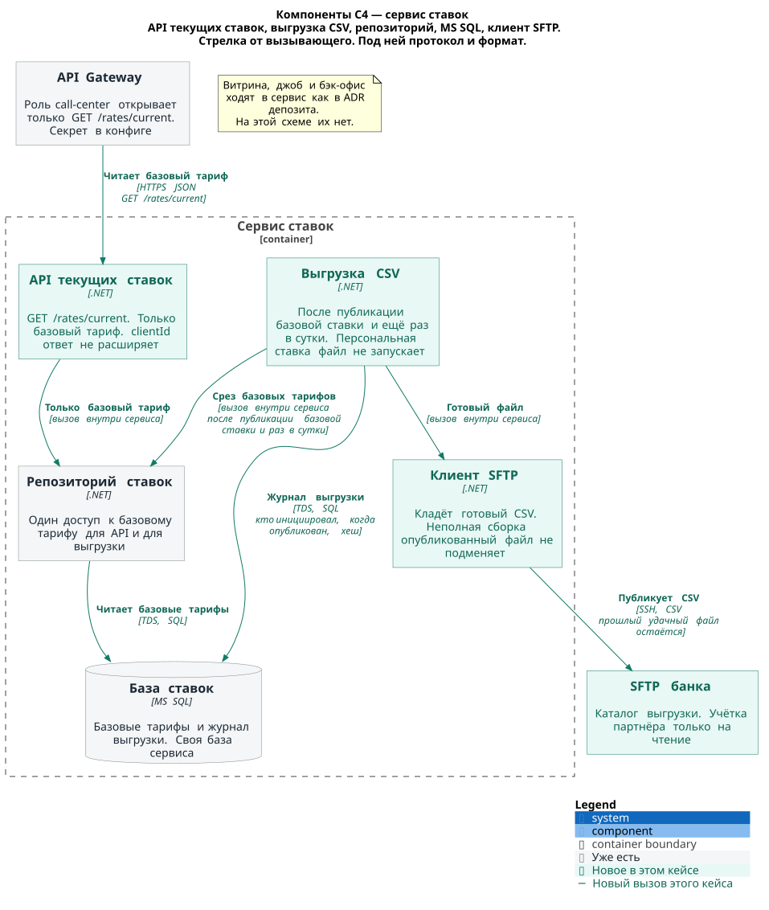
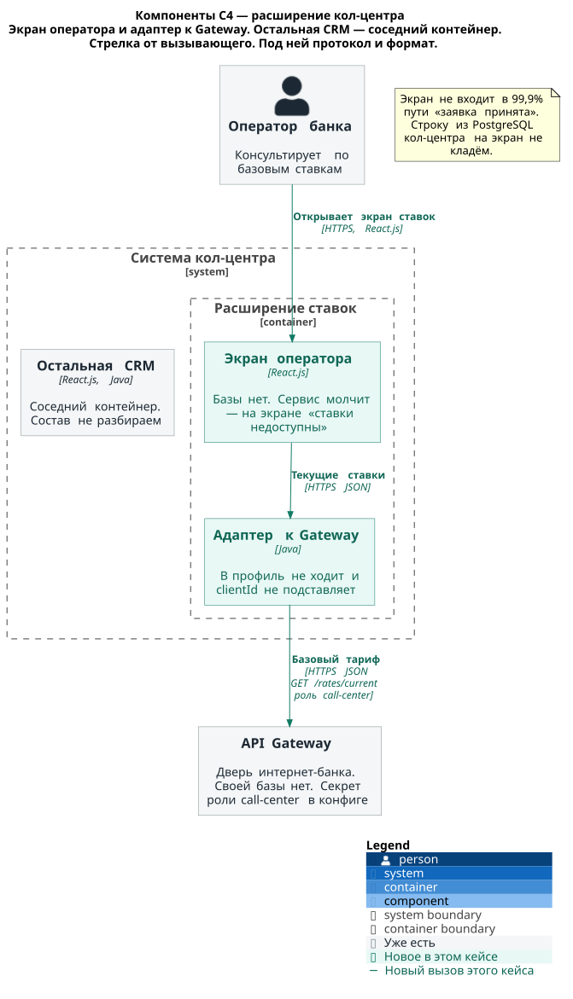

# ADR. Передача ставок в кол-центр

### Название задачи:

STD-ADR-4. Базовые ставки для своего кол-центра и для кол-центра партнёра

### Автор:

d.karpov

### Дата:

04.10.2026

### Функциональные требования

Источник истины тот же, что в ADR открытия депозита. Бэк-офис публикует ставку в сервис ставок. Этот кейс отдаёт наружу только базовый тариф: без `clientId` и без персональной ставки. Особые условия кол-центра, заявка с сайта и кредит сюда не входят. Файл для партнёра — выгрузка сервиса, не новый Excel и не второе место, где ставку ведут.

| **№** | **Действующие лица или системы** | **Use Case** | **Описание** |
| :-: | :- | :- | :- |
| UC1 | Оператор банка, экран на React.js, адаптер на Java, API Gateway, сервис ставок | Чтение базовых ставок | 1. Оператор банка открывает экран ставок на React.js. Экран в базы не ходит. 2. Адаптер на Java вызывает уже существующий API Gateway: HTTPS JSON, GET /rates/current. 3. Роль `call-center` открывает только этот метод. Секрет роли смонтирован в конфиг Gateway, свою базу шлюз под это не заводит. 4. Сервис ставок на этом маршруте отдаёт базовый тариф. `clientId` в запросе ответ не расширяет. 5. Оператор видит текущие базовые ставки. Сервис молчит — на экране «ставки недоступны». Строку из PostgreSQL кол-центра на экран не кладём. F10. |
| UC2 | Бэк-офис депозитов, сервис ставок, выгрузка CSV, SFTP банка | Публикация базовой ставки порождает файл | 1. Бэк-офис по-прежнему публикует ставку в сервис. Способ публикации этот ADR не меняет. 2. Опубликована базовая ставка — компонент выгрузки в сервисе ставок собирает CSV базовых тарифов. Персональная ставка файл не запускает. 3. Тот же CSV собирается ещё раз в сутки, тоже только из базовых тарифов. 4. Готовый файл кладётся на SFTP банка. 5. В журнал выгрузки пишется, кто инициировал сборку, когда файл опубликован и хеш файла. F10, +R10. |
| UC3 | Система партнёра, SFTP банка, оператор партнёра | Чтение ставок из файла | 1. Система партнёра забирает последний файл с SFTP банка. Учётка партнёра только на чтение, канал SSH. 2. Партнёр API не вызывает. 3. Оператор партнёра читает ставки в своей системе. Банк эту систему не пишет. 4. Заявку с сайта партнёр не ведёт. +R10. |
| UC4 | Выгрузка CSV, SFTP банка, система партнёра | Сбой выгрузки оставляет прошлый файл | 1. Новая сборка CSV не закончилась. 2. Прошлый удачный файл на SFTP остаётся на месте. 3. Партнёр читает его той же учёткой. 4. Журнал хранит хеш последнего опубликованного файла. Источник истины по-прежнему сервис ставок. |

### Нефункциональные требования

В таблицу попали требования, которые меняют контейнеры и вызовы. Число операторов и удобство экрана сюда не входят.

| **№** | **Требование** |
| :-: | :- |
| — | В GET /rates/current и в CSV только базовый тариф, без `clientId` и без персональной ставки. |
| S5 | Журнал выгрузки пишет, кто инициировал сборку, когда файл опубликован и хеш файла. Смена ставки в сервисе журналируется по-прежнему отдельно. |
| R2 | Экран кол-центра не входит в 99,9% пути «заявка принята». Отказ сервиса ставок на этом экране метрику приёма не двигает. |
| +R1 | Выгрузка — .NET в сервисе ставок. Экран — React.js. Адаптер к Gateway — Java. Новый язык не вводим. |
| +R2 | Kafka на этом маршруте нет. |
| +R4 | АБС на этом маршруте нет: ни её API, ни Oracle. |

### Решение

Ставка живёт в сервисе ставок. Бэк-офис публикует её туда же, куда публиковал для интернет-банка. Консультация кол-центра читает только базовый тариф.

Своему кол-центру хватает HTTP: система стоит в банке. Партнёр API не принимает, ему уходит файл (+R10). Оба канала смотрят в один сервис. Файл сервис не подменяет.

На контексте этого кейса шесть участников. Оператор банка. Система кол-центра. API Gateway — дверь интернет-банка, уже есть. Сервис ставок. SFTP банка. Система партнёра и её оператор. Заявка, СМС и Delphi на этих схемах не стоят.

Сервис ставок внутри разбирается на компоненты. API текущих ставок принимает GET /rates/current. Выгрузка CSV собирает файл после публикации базовой ставки и ещё раз в сутки. Оба читают базовый тариф через один репозиторий, вторая дорога в обход него не нужна. Репозиторий читает свою MS SQL. Клиент SFTP кладёт готовый CSV на SFTP банка. Персональные строки репозиторий на этих двух вызовах не отдаёт.

Кол-центр вскрываем точечно. Новый экран оператора на React.js и адаптер к Gateway на Java. Остальная CRM — соседний контейнер, её состав этот ADR не разбирает. Экран в PostgreSQL за ставкой не ходит. Адаптер вызывает Gateway. Оператор кол-центра — не сессия интернет-банка: шлюз в профиль не идёт и `clientId` не подставляет. Свой кол-центр ходит в API Gateway по TLS. Выгрузка кладёт файл на SFTP банка по SSH.

У Gateway своей базы нет. Секрет роли `call-center` смонтирован в конфиг, новую базу под роль не заводим. Роль открывает только GET /rates/current. Сервис ставок на этом маршруте всё равно отдаёт базовый тариф, даже если в запросе оказался `clientId`. Маршрут витрины GET /rates остаётся как в ADR депозита: там у клиента есть и персональная ставка.

Выгрузка публикует файл целиком. Сборка оборвалась — прошлый удачный файл на SFTP не трогаем, хеш в журнале остаётся от него. Партнёр забирает последний опубликованный файл учёткой только на чтение. В файл не попадают ни `clientId`, ни персональная ставка.

Отказ сервиса ставок на экране оператора — текст «ставки недоступны». Вчерашнюю ставку из PostgreSQL кол-центра не показываем. В 99,9% пути «заявка принята» этот экран не входит.

Команды. GET /rates/current, выгрузку и журнал файла делает команда интернет-банка, та же, что ведёт сервис ставок. Роль `call-center` на уже существующем Gateway делает она же. Экран на React.js и адаптер на Java делает подрядчик платформы кол-центра, 5 человек. Точечно могут помочь Java-специалисты команды АБС. Каталог на SFTP и учётку только на чтение заводит IT-отдел. Систему партнёра банк не пишет: партнёр разбирает CSV у себя. Бэк-офис депозитов по-прежнему публикует ставку в сервис.

#### Кто кого вызывает

Стрелка на схемах идёт от вызывающего. Вторая строка — протокол и формат.

| Кто вызывает | Кого | Протокол и формат | Что в теле | Чей это контекст |
| --- | --- | --- | --- | --- |
| Оператор банка | Экран кол-центра | HTTPS, React.js | Экран базовых ставок | Кол-центр, у экрана базы нет |
| Экран кол-центра | Адаптер к Gateway | HTTPS JSON, Java | Запрос текущих ставок внутри кол-центра | Кол-центр |
| Адаптер к Gateway | API Gateway | HTTPS JSON, GET /rates/current | Роль `call-center`. Секрет из конфига шлюза, не из новой базы. Канал по TLS | Дверь интернет-банка |
| API Gateway | API текущих ставок | HTTPS JSON, GET /rates/current | Базовый тариф. `clientId` ответ не расширяет | Ставки |
| API текущих ставок | Репозиторий ставок | Вызов внутри сервиса | Только базовый тариф | Ставки |
| Репозиторий ставок | MS SQL ставок | TDS, SQL | Базовые тарифы. Своя база сервиса | Ставки |
| Выгрузка CSV | Репозиторий ставок | Вызов внутри сервиса | Срез базовых тарифов после публикации базовой ставки и раз в сутки | Ставки, .NET |
| Выгрузка CSV | Журнал выгрузки | Запись в MS SQL ставок | Кто инициировал, когда файл опубликован, хеш | Ставки |
| Клиент SFTP | SFTP банка | SSH, CSV | Готовый файл базовых ставок. Неполная сборка опубликованный файл не подменяет | Банк, каталог ведёт IT-отдел |
| Система партнёра | SFTP банка | SFTP по SSH, только чтение | Последний опубликованный файл | Партнёр API не вызывает |
| Оператор партнёра | Система партнёра | Как устроено у партнёра | Ставки из файла | Внешняя система, банк её не пишет |

Витрина интернет-банка, джоб учёта и бэк-офис ходят в сервис ставок как в ADR депозита. На схемах этого кейса их нет.

#### Паттерны на вызовах

Берём то, без чего оператор увидит чужую ставку или партнёр потеряет последний файл.

Роль на Gateway. `call-center` открывает один метод, GET /rates/current. Секрет лежит в конфиге шлюза. Шлюз его сверяет сам, в базу заявок этот секрет не кладём: туда в ADR депозита положен хеш ключа джоба, это другой вход. Сервис ставок второй раз режет ответ до базового тарифа.

Один репозиторий. API текущих ставок и выгрузка читают базовый тариф в одном месте. Расхождение канала HTTP и канала CSV лечится расписанием выгрузки, не второй формулой ставки.

Целая выгрузка. Файл на SFTP становится текущим, когда сборка дошла до конца и хеш записан. Обрыв сборки оставляет прошлый файл и его хеш.

Отказ на экране. Сервис ставок молчит — оператор читает «ставки недоступны». PostgreSQL кол-центра ставку не подменяет. Этот отказ в счётчик «заявка принята» не входит.

Совместимость CSV. Колонки файла только добавляем. Смысл базового тарифа между сервисом ставок и разбором у партнёра между релизами не меняется. Сначала партнёр умеет пропустить новую колонку, потом начинаем её писать.

На этом этапе не ставим. Кэш ставок в PostgreSQL кол-центра. Kafka между сервисом и кол-центром. API партнёру. Чтение MS SQL снаружи сервиса. Вызов АБС за ставкой.

#### Схемы

Исходники лежат рядом с этим ADR, в `Task4/c4`. SVG собирает GitHub Actions из этих файлов и кладёт туда же. На схемах только передача ставок.

Контекст. Оператор банка, система кол-центра, API Gateway, сервис ставок, SFTP банка, система партнёра и оператор партнёра. Заявка, СМС и АБС не нарисованы.

Компоненты сервиса ставок. API текущих ставок, выгрузка CSV, репозиторий, MS SQL, клиент SFTP. Снаружи — вызов Gateway и запись на SFTP.

Компоненты расширения кол-центра. Экран оператора и адаптер к Gateway. Остальная CRM — соседний контейнер, без состава внутри.

### Альтернативы

API ставок из АБС, как на странице `Roadmap_change`. В MVP ставку отдаёт сервис ставок. АБС эту ставку не публикует. Синхронный вызов в Oracle на консультацию кол-центра открыл бы путь, который приём заявки себе уже закрыл (+R4).

Файл и своему кол-центру. Система кол-центра стоит в банке и умеет HTTP. Файл добавил бы ей ту же задержку, что у партнёра, при живом GET /rates/current.

API партнёру. Партнёр API не принимает, система внешняя (+R10). Канал к нему — файл на SFTP банка.

Прямое чтение MS SQL сервиса ставок. У кол-центра и у партнёра появилась бы чужая база. Партнёру учётку на базу не выдаём. Свой кол-центр входит через Gateway.

Почта с Excel. Так ставки ходят сегодня. Для консультации это снова письмо, без роли и без журнала файла. Источник истины остаётся сервис (F10).

Кэш ставок в PostgreSQL кол-центра. Экран тогда показывает вчерашний тариф, пока сервис молчит. На экране в этот момент текст «ставки недоступны».

Kafka от сервиса ставок к кол-центру. Шина появляется у заявок, не у ставок. В монолит её не встраиваем (+R2). Своему кол-центру хватает GET. Партнёру нужен файл.

### Недостатки, ограничения, риски

Партнёр видит ставку позже оператора банка. Файл появляется после публикации базовой ставки и ещё раз в сутки. Между этими точками на SFTP лежит прежний CSV.

Пока новая сборка не дошла до конца, партнёр читает прошлый файл. Цифра в его системе может отстать от сервиса. Оператор банка в это время ходит в сервис по HTTPS.

Два канала одного тарифа. Пока файл не обновлён, оператор банка и оператор партнёра называют разные числа. Сходятся они в сервисе, не в файле.

Экран кол-центра зависит от Gateway и сервиса ставок. Отказ виден оператору и в 99,9% приёма заявки не входит.

Платформу кол-центра сопровождает подрядчик, 5 человек. Банк не переписывает CRM. В объёме этого ADR — экран и адаптер. Java-специалисты АБС подключаются точечно, ядро АБС под ставки кол-центра не меняется.

Файл — производная сервиса. Учётка партнёра только на чтение, чтобы CSV не стали править руками и не вернули Excel.

Персональную ставку и особое условие этот экран не показывает. Их ведут вне этого кейса: персональную ставку публикует бэк-офис в сервис, особое условие остаётся в согласовании заявки.

Секрет роли `call-center` лежит в конфиге Gateway. Смена секрета — смена конфига. Строки в новой базе под этот секрет нет.
