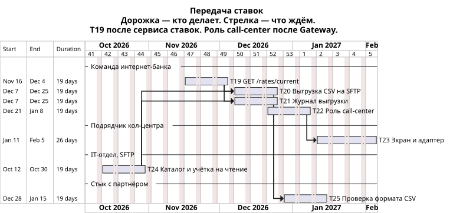

# Задачи передачи ставок

Номера продолжают [план MVP депозита](../Task3/plan-6-months.md): последняя задача там — T18. Здесь системы [ADR передачи ставок](ADR.md). Заявку на депозит и цель года эта страница не раскладывает.

Кол-центр ждёт уже запланированные сервис ставок (T2) и API Gateway (T4, T5). Экран оператора и файл партнёра в 99,9% пути «заявка принята» не входят и выкладку депозита (T17) не задерживают.

Длительность укрупнённая: команды потом режут эпики на свои задачи. Сроки ниже — порядок и зависимости. Старт тот же, что у плана депозита: 5 октября 2026.

## Задачи

| Номер | Задача | Система | Команда |
| --- | --- | --- | --- |
| T19 | GET /rates/current: сервис отдаёт базовый тариф. `clientId` в запросе ответ не расширяет, персональная ставка в ответ не попадает | Ставки | Интернет-банк |
| T20 | Выгрузка CSV базовых ставок на SFTP банка. Сборка после публикации базовой ставки и ещё раз в сутки. Персональная ставка файл не запускает. Неполная сборка прошлый файл не затирает | Ставки | Интернет-банк |
| T21 | Журнал выгрузки в MS SQL ставок: кто инициировал сборку, когда файл опубликован, хеш. Обрыв сборки оставляет хеш последнего опубликованного файла | Ставки | Интернет-банк |
| T22 | Роль `call-center` на API Gateway: открыт только GET /rates/current. Секрет роли в конфиге шлюза, новую базу под роль не заводим | API Gateway | Интернет-банк |
| T23 | Экран базовых ставок на React.js и адаптер к Gateway на Java. Экран в базы не ходит. Сервис молчит — на экране «ставки недоступны» | Кол-центр | Подрядчик платформы, 5 человек; точечно Java-специалисты АБС |
| T24 | Каталог выгрузки на SFTP банка и учётка партнёра только на чтение | SFTP | IT-отдел |
| T25 | Стык с партнёром: проверка формата CSV. Файл разбирает система партнёра у себя. Банк эту систему не пишет | Система партнёра | Стык с партнёром |

Подрядчик платформы кол-центра берёт T23. CRM целиком и ядро АБС под этот кейс не меняем. Бэк-офис депозитов публикует ставку как в плане депозита (T10), отдельной задачи на публикацию здесь нет.

## Кто от кого зависит

- T19 ждёт T2: метод читает тариф, который уже ведёт сервис ставок.
- T22 ждёт T4, T5 и T19: роль садится на уже существующий шлюз и на метод, который отдаёт базовый тариф.
- T23 ждёт T22. Через эту цепочку экран стоит за сервисом ставок (T2) и за Gateway (T4, T5). В MS SQL ставок экран не ходит.
- T24 никого из этого списка не ждёт. Каталог и учётку заводит IT-отдел.
- T20 ждёт T19 и T24: CSV собирается из базовых тарифов и кладётся в готовый каталог.
- T21 идёт вместе с T20. Хеш пишется в той сборке, которая публикует файл. Раньше конца T20 журнал нового файла не закрывается.
- T25 ждёт T20 и T21: партнёр забирает последний опубликованный файл, формат сверяем по нему. API партнёру не открываем.

T23 и T25 не стоят на пути T15 и T17.

## Две карты

Охват разный.

Карта ниже — только передача ставок. Дорожка — кто делает: команда интернет-банка (ставки и роль Gateway), подрядчик кол-центра, IT-отдел (SFTP), стык с партнёром. Стрелка — эту задачу не начинаем, пока не кончилась предыдущая. Заявки, СМС и цели года на ней нет.

Вторая карта — [roadmap.drawio](roadmap.drawio). Строки там — системы, не команды. Q4 2026 и Q1 2027: задачи депозита из плана на 6 месяцев, укрупнённые по системам, и задачи этого списка. Выкладка MVP — начало Q2 2027. Q2–Q3 2027: цель года, сервис ставок на место не переезжает. Кредит на ту карту не кладём. Экран кол-центра и файл партнёра и там стартуют после сервиса ставок и не стоят на критическом пути «заявка принята».
