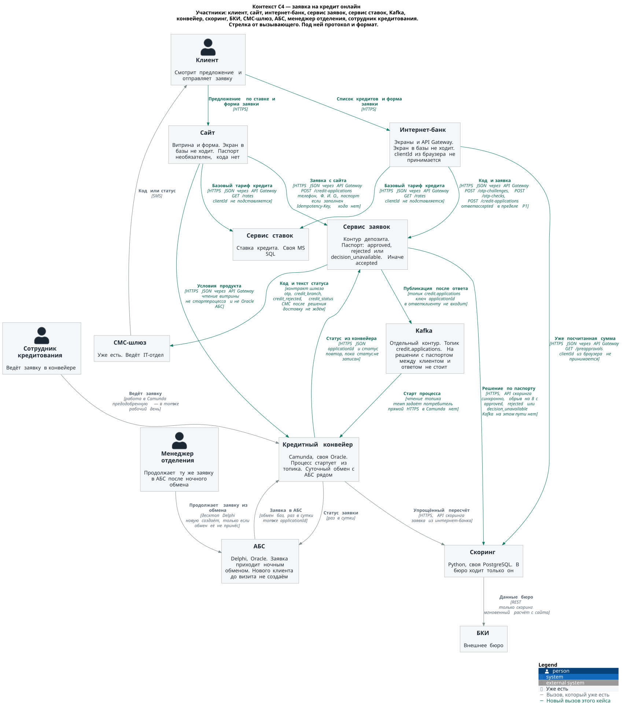
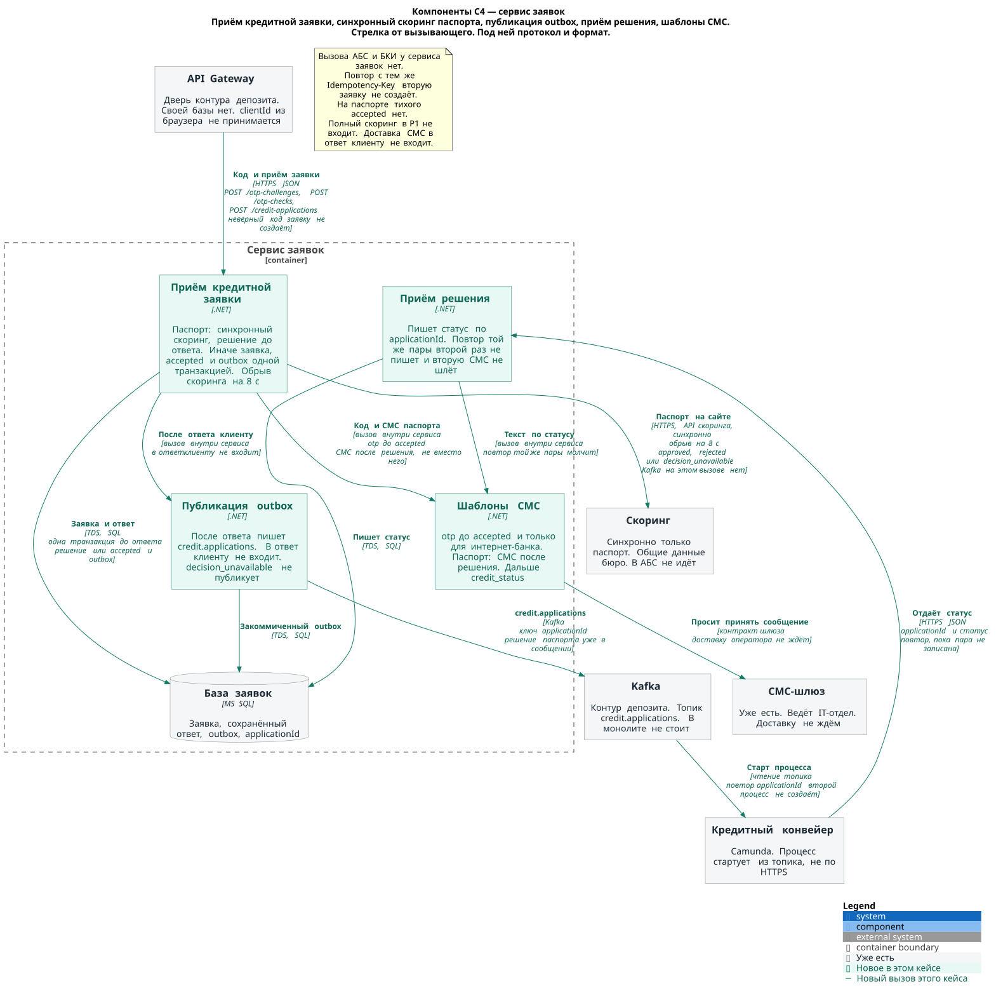
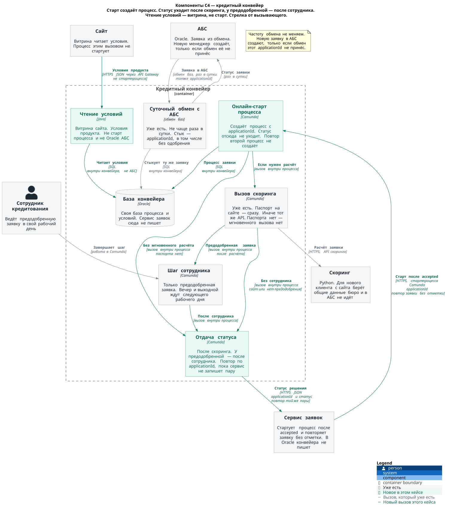
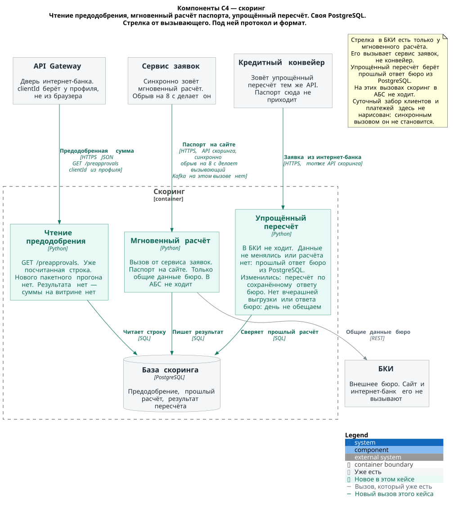

# ADR. Заявка на кредит онлайн

### Название задачи:

STD-ADR-5. Приём кредитной заявки с сайта и из интернет-банка и решение в тот же день

### Автор:

d.karpov

### Дата:

07.10.2026

### Функциональные требования

Горизонт — год после MVP депозита. Контур приёма из ADR открытия депозита уже стоит: этот кейс его не переоткрывает. Ставка по-прежнему живёт в сервисе ставок. Кластер Kafka уже стоит отдельным контуром с депозита. Этот кейс добавляет топик credit.applications и не встраивает клиент шины в монолит ASP.NET. Как есть, АБС и кредитный конвейер обмениваются базами раз в сутки, скоринг ходит в БКИ по REST и раз в сутки забирает из АБС клиентов и платежи. Частоту этого обмена кейс не меняет.

| **№** | **Действующие лица или системы** | **Use Case** | **Описание** |
| :-: | :- | :- | :- |
| UC1 | Клиент, сайт, API Gateway, сервис ставок, кредитный конвейер | Витрина кредита на сайте | 1. Клиент открывает предложение кредита. Экран в базы не ходит. 2. Сайт вызывает API Gateway: HTTPS JSON, GET /rates. clientId в этот вызов не подставляется. Сервис ставок отдаёт базовый тариф кредитного продукта. Персональная ставка депозита в ответ не входит. 3. Сайт отдельно читает полные условия через API Gateway у кредитного конвейера. Это чтение витрины: процесс заявки ещё не стартовал, в Oracle АБС запрос не идёт. 4. Клиент видит предложение по ставке и условия продукта. F11. |
| UC2 | Клиент, сайт, API Gateway, сервис заявок, скоринг, БКИ, СМС-шлюз, Kafka, кредитный конвейер | Заявка с сайта | 1. С сайта уходят телефон и Ф. И. О. Паспорт необязателен. Кода подтверждения нет. 2. Экран до POST создаёт Idempotency-Key и хранит его, пока клиент не увидел ответ. 3. Сайт вызывает API Gateway: HTTPS JSON, POST /credit-applications. 4. Паспорт заполнен. Сервис заявок синхронно зовёт скоринг, напрямую, не через API Gateway. Скоринг берёт только общие данные БКИ по REST и в АБС не идёт. Kafka на этом вызове не стоит. 5. Ответ клиенту — approved или rejected. Предел P1b: p95 ≤ 5 с на API Gateway, обрыв вызова скоринга на 8 с. На 8 с без ответа клиент получает decision_unavailable. Тихого accepted нет. Заявка и этот ответ коммитятся одной транзакцией до ответа. 6. Повтор с тем же Idempotency-Key вторую заявку не создаёт. Сохранённые approved и rejected возвращаются без нового скоринга. decision_unavailable считает скоринг ещё раз с тем же applicationId. Ответ скоринга, пришедший после обрыва, записанный decision_unavailable не меняет. 7. СМС об отказе или о визите уходит после решения, не вместо него. decision_unavailable СМС не порождает. Доставку оператором ответ клиенту не ждёт. 8. Паспорта нет. Мгновенного скоринга нет, ответ accepted законен и укладывается в P1. Скоринг, конвейер и АБС этот ответ не ждут. СМС зовёт в отделение, потому что мгновенного отказа не было. 9. После ответа клиенту публикация читает закоммиченный outbox и пишет credit.applications. Ключ — applicationId. decision_unavailable в топик не пишется. Прямого HTTPS в Camunda нет. Повтор того же applicationId второй процесс не создаёт. Новый клиент в АБС до визита не создаётся. F4, F12, F13, F14. |
| UC3 | Клиент, экраны интернет-банка, API Gateway, профиль, сервис ставок, скоринг | Витрина кредита в интернет-банке | 1. Клиент открывает список кредитов. Экран в базы не ходит. 2. Экран вызывает API Gateway: GET /rates и GET /preapprovals. clientId из браузера не принимается. 3. В GET /rates Gateway не подставляет clientId. Уходит базовый тариф кредитного продукта. Персональная ставка депозита в этот ответ не входит. 4. В GET /preapprovals Gateway по сессии берёт clientId у профиля. 5. Предодобренную сумму отдаёт скоринг из уже посчитанного результата в своей PostgreSQL. Нового пакетного прогона нет. На этом чтении скоринг в БКИ и в АБС не ходит. 6. Результата нет — предодобренной суммы на витрине нет. F16. |
| UC4 | Клиент, экраны интернет-банка, API Gateway, профиль, сервис заявок, СМС-шлюз, Kafka, кредитный конвейер, скоринг, сотрудник кредитования | Заявка из интернет-банка | 1. Код подтверждения обязателен до приёма. Экран создаёт Idempotency-Key. Gateway берёт телефон у профиля. Сервис заявок просит СМС-шлюз принять код к отправке и не ждёт, пока оператор доставит SMS. Неверный код заявку не создаёт. 2. После верного кода экран шлёт POST /credit-applications: счёт зачисления и данные заявки. Счёт экран берёт из копии счетов, как в ADR депозита. Oracle на этом шаге не читается. 3. Сервис заявок отвечает accepted в пределе P1. Полный скоринг в этот ответ не входит. Синхронного решения по паспорту на этом канале нет. 4. Заявка, accepted и строка outbox пишутся одной транзакцией до ответа. После ответа публикация пишет тот же топик credit.applications. Потребитель конвейера стартует процесс. Прямого HTTPS в Camunda нет. Повтор того же applicationId второй процесс не создаёт. Публикация в ответ «принята» не входит. 5. Предодобрение уже было и данные клиента не изменились — скоринг возвращает прошлый результат и в БКИ не ходит. Сотрудник кредитования обрабатывает заявку в конвейере в тот же рабочий день. Вечер и выходной попадают на следующий рабочий день. 6. Данные изменились — упрощённый пересчёт по уже сохранённому ответу бюро. В БКИ этот пересчёт не ходит. 7. Предодобрения не было. День здесь календарный: решение даёт скоринг, сотрудник для него не нужен. Обещаем его, только если хватает вчерашней выгрузки АБС и ответа бюро. Любого из двух нет — день не обещаем и синхронно в АБС за клиентом не идём. F17, F18, F19, F20. |
| UC5 | Сервис заявок, СМС-шлюз, клиент | СМС о статусе кредитной заявки | 1. На пути паспорта сервис заявок уже отдал клиенту approved или rejected. Шаблон уходит после этой записи: отказ — credit_rejected, одобрение — credit_branch. СМС решение не подменяет. decision_unavailable шаблон не выбирает. 2. Конвейер отдаёт сервису заявок applicationId и статус и повторяет отдачу, пока сервис не запишет эту пару. Повтор той же пары второй статус не пишет и вторую СМС не шлёт. 3. Паспорта на сайте нет — мгновенного отказа не было, после accepted уходит credit_branch. Смена статуса — credit_status, когда пара записана впервые. 4. Недоставка не отменяет уже отданное решение и уже принятую заявку. Сообщение можно повторить. Доставка оператором в P1, P1b и в 99,9% не входит. F13, F14, F21. |
| UC6 | АБС, кредитный конвейер, менеджер отделения | Та же заявка в отделении | 1. Ночной обмен баз переносит в АБС заявку с тем же applicationId, с которым она ушла в топик днём, и статус обратно в конвейер. Чаще раза в сутки обмен не ходит. Одобрение для переноса не нужно: заявка с сайта без паспорта тоже уходит этим обменом. decision_unavailable в топик не попадала — обмену её брать неоткуда, пока повтор не принесёт решение. 2. Менеджер отделения ищет заявку по applicationId. Обмен её уже положил — продолжает её, было предварительное одобрение или нет. 3. Новую заявку в АБС менеджер создаёт, только если ночной обмен этой заявки не принёс. 4. Вторая заявка с тем же applicationId не создаётся. До этой ночи клиент уже мог получить СМС. F15. |

### Нефункциональные требования

В таблицу попали требования, которые меняют контейнеры и вызовы. Удобство формы сюда не входит. Числа P1, P1b, P3, R3 и версия TLS взяты из FURPS+: в кейсе они не заданы.

| **№** | **Требование** |
| :-: | :- |
| R1 | Приём заявки доступен 24/7. Проведение в АБС и полный скоринг в ответ accepted не входят. Заявка с сайта с паспортом — другая операция: в её ответ входит только общий срез бюро, в пределе P1b. Конвейер и скоринг уже работают круглосуточно. |
| R2 | Доступность приёма заявки 99,9%. Считается по ответу «заявка принята». Ответ с паспортом в эту метрику не входит: его мера — P1b. |
| R3 | Переключение приёма заявки на резервный ЦОД: RTO ≤ 15 мин. RPO = 0 для заявки, на которую уже ответили: строка закоммичена до ответа. 99,9% — не больше 43 минут простоя в месяц на сценарии S4. |
| P1 | Витрина и ответ «заявка принята»: p95 ≤ 300 мс, p99 ≤ 800 мс на API Gateway. АБС и полный скоринг в этот предел не входят. Заявка с паспортом — P1b. |
| P1b | Заявка с сайта с паспортом: p95 ≤ 5 с, обрыв на 8 с. Ответ клиенту — approved, rejected или явный decision_unavailable. Тихого accepted нет. |
| P3 | Контур приёма держит 20 RPS постоянно и 50 RPS коротким всплеском. Новых пакетных пиков скоринга нет. Поток в конвейер регулирует топик credit.applications: потребитель читает его в своём темпе. |
| S2 | Приём заявки, шаблоны СМС и чтение предодобрения делает банк. Ядро интернет-банка и СМС внутри ядра подрядчику не отдаём. |
| S3 | Интеграционная проверка цепочки: заявка с паспортом и обрыв на 8 с, повтор того же Idempotency-Key, заявка без паспорта, повтор публикации, скоринг, БКИ, повтор статуса, СМС-шлюз и ночной обмен с АБС по applicationId. Вторая заявка в отделении не создаётся, если обмен уже принёс этот идентификатор. |
| S4 | 99,9% считается по сценарию «клиент отправил заявку и получил ответ, что она принята». Заявка с паспортом в этот сценарий не входит. |
| S6 | Кредитная заявка выкатывается тем же контуром, отдельно от платежей. Сбой заявки платежи не останавливает. |
| +R1 | Сервис заявок остаётся на .NET и MS SQL. Скоринг остаётся на Python. Конвейер остаётся на Camunda. Новый язык не вводим. |
| +R2 | Kafka не встраивается в монолит ASP.NET. Шина — отдельный контур депозита. В конвейер заявка идёт топиком credit.applications. На синхронном пути паспорта шина между клиентом и решением не стоит. |
| +R3 | Приём кредита идёт контуром депозита. Отдельный сервис кредита не заводим. |
| +R4 | Сайт и интернет-банк не вызывают API АБС и не читают её базу. Повтор с тем же applicationId вторую заявку не создаёт. |
| +R5 | TLS 1.2 минимум, TLS 1.3 предпочтительно. TLS 1.0 и 1.1 не принимаем. Каналы, где едут телефон, Ф. И. О., паспорт или счёт. |
| +R6 | Обмен баз АБС и кредитного конвейера остаётся не чаще раза в сутки. |
| +R7 | Код и уведомления идут через существующий шлюз IT-отдела. |
| +R8 | Пакетного предрасчёта нет. Витрина читает уже посчитанный результат. |
| +R11 | БКИ вызывает только скоринг. Для нового клиента с сайта скоринг берёт общие данные бюро и в АБС не идёт. |

### Решение

Приём кредитной заявки сидит на том же контуре, что депозит. Сайт и интернет-банк ходят в API Gateway. Ответа два. Паспорт на сайте заполнен — сервис заявок синхронно зовёт скоринг и отвечает approved, rejected или decision_unavailable. Этот ответ измеряется P1b. Паспорта нет или заявка из интернет-банка — ответ accepted в пределе P1. В 99,9% входят витрина и ответ accepted. Решение паспорта, конвейер, публикация в Kafka и АБС в эту метрику не входят.

Паспорт. Сервис заявок вызывает API скоринга напрямую и обрывает вызов на 8 с. Скоринг на этом вызове берёт общие данные бюро и в АБС не идёт. Конвейер этот вызов не делает. Клиент видит решение в ответе POST. Тихого accepted нет. Заявка и ответ коммитятся до отправки ответа. Сохранённые approved и rejected повтор с тем же ключом возвращает как есть. decision_unavailable тот же ключ отправляет в скоринг ещё раз и вторую заявку не создаёт. Ответ бюро после обрыва записанную строку не переписывает.

В конвейер заявка попадает топиком credit.applications после ответа клиенту. Ключ — applicationId. В сообщении с паспортом решение уже лежит, и конвейер скоринг повторно не зовёт. decision_unavailable в топик не пишется. Прямого HTTPS в Camunda нет. Кластер тот же, что у депозита, отдельным контуром. Клиент Kafka в монолит ASP.NET не встраивается. Топик заводит инженер Kafka, уже нанятый в команду интернет-банка на депозите. Новый найм под кредит не нужен. Потребитель на стороне конвейера читает топик и стартует процесс в своём темпе: всплеск приёма не становится пачкой синхронных стартов Camunda. Повтор того же applicationId второй процесс не создаёт. Публикация в ответ клиенту не входит. Молчание брокера лечится следующим чтением закоммиченной строки outbox.

Суточный обмен баз АБС и конвейера остаётся как есть. В АБС уходит заявка с тем же applicationId, в том числе с сайта и без одобрения. Менеджер отделения продолжает то, что принёс обмен. Новую заявку в АБС он создаёт, только если обмена этой заявки не было.

Сайт и интернет-банк БКИ не вызывают и Oracle АБС не читают. В бюро ходит только скоринг, по REST, как сейчас. Для нового клиента с сайта это общие данные бюро: скоринг на этом вызове в АБС не идёт, и клиент в АБС до визита не создаётся.

Витрина кредита читает базовый тариф кредитного продукта. GET /rates на этом маршруте идёт без clientId: шлюз его не подставляет ни с сайта, ни из сессии интернет-банка. Персональная ставка депозита остаётся на витрине депозита. Предодобренная сумма живёт отдельно, в GET /preapprovals: туда clientId из профиля подставляется.

Полные условия на сайте читает витрина, отдельным вызовом в конвейер через API Gateway. Процесс заявки к этому чтению не нужен, Oracle АБС тоже.

Предодобренная сумма на витрине интернет-банка — чтение уже посчитанной строки. Пакетный прогон под просмотр не запускаем. Полный скоринг и доставка СМС в ответ accepted не входят.

Код подтверждения обязателен только в интернет-банке, до приёма, тем же шагом, что у депозита: сервис заявок ждёт от шлюза «принято к отправке» и не ждёт доставку на телефон. С сайта уходят телефон и Ф. И. О. Паспорт есть — клиент получает решение в ответе POST, СМС об отказе или о визите уходит следом. Паспорта нет — мгновенного скоринга нет, ответ accepted, СМС зовёт в отделение.

Повторный скоринг упрощённый и только при смене данных клиента. Его зовёт конвейер уже после старта процесса из топика, тем же API скоринга. Данные не менялись — скоринг отдаёт прошлый ответ бюро из своей PostgreSQL и в БКИ не ходит. Данные изменились — упрощённый пересчёт по уже сохранённому ответу бюро, в БКИ тоже не ходит. Заявка из интернет-банка без предодобрения получает решение за календарный день, только если хватает вчерашней выгрузки АБС и ответа бюро. Любого из двух нет — день не обещаем и за клиентом в АБС синхронно не идём. Сотрудник кредитования для этого решения не нужен. Его рабочий день относится к предодобренной заявке: вечер и выходной ждут следующего рабочего дня.

На контексте этого кейса: клиент, сайт, интернет-банк, сервис заявок, сервис ставок, Kafka, кредитный конвейер, скоринг, БКИ, СМС-шлюз, АБС, менеджер отделения, сотрудник кредитования. Кол-центр, партнёр, платежи и депозитное проведение здесь не стоят.

Сервис заявок внутри разбирается на компоненты этого кейса. Приём с паспортом синхронно зовёт скоринг и пишет решение до ответа. approved и rejected кладут строку outbox в ту же транзакцию. decision_unavailable строку outbox не пишет. Приём без паспорта и из интернет-банка пишет заявку, accepted и outbox одной транзакцией. Публикация после commit пишет credit.applications и в ответ клиенту не входит. Приём решения записывает статус по applicationId и на повтор той же пары молчит. Шаблоны СМС выбирают текст и зовут существующий шлюз. Своя база — MS SQL заявок. Вызова АБС и БКИ у сервиса заявок нет.

Конвейер вскрываем точечно. Новый вход — потребитель топика: он читает credit.applications и создаёт процесс. Статус отсюда не уходит. Паспортное решение уже лежит в сообщении, мгновенный скоринг конвейер не вызывает. Заявку из интернет-банка процесс отдаёт в уже существующий вызов скоринга. Паспорта нет — мгновенного вызова нет. Статус уходит после скоринга, а у предодобренной заявки ещё и после сотрудника кредитования. Рядом — чтение условий для витрины сайта: это не старт процесса. И уже существующий суточный обмен базами с АБС. Своя база конвейера по-прежнему Oracle, сервис заявок в неё не пишет.

Скоринг вскрываем точечно. Чтение уже посчитанного предодобрения. Сервис заявок вызывает мгновенный расчёт заявки с сайта. Конвейер этот расчёт не вызывает. Расчёт берёт только общие данные бюро, этот вызов в БКИ ходит, обрыв на 8 с делает сервис заявок. Конвейер вызывает упрощённый пересчёт, и в БКИ этот пересчёт не ходит: данные не менялись — прошлый ответ бюро, изменились — пересчёт по уже сохранённому ответу. Нет вчерашней выгрузки или ответа бюро — день не обещаем. Своя база — PostgreSQL. На этих вызовах скоринг в АБС не ходит. Суточный забор клиентов и платежей из АБС остаётся прежним каналом и новым синхронным вызовом не становится.

Команды. Приём, Gateway, синхронный вызов скоринга, публикацию outbox, чтение предодобрения через шлюз и шаблоны СМС делает команда интернет-банка, 10 человек, та же, что ведёт сервис заявок. Топик на уже стоящем кластере заводит инженер Kafka из этой команды. Ядро интернет-банка и СМС в ядре подрядчику не отдаём. Конвейер дорабатывают потребителем топика и описанием процесса: часть — подрядчик внедрения, часть — IT банка. Скоринг пишут сотрудники IT банка на Python. СМС-шлюз остаётся у IT-отдела. Заявку в конвейере в свой рабочий день ведёт сотрудник кредитования. В АБС после ночного обмена её продолжает менеджер отделения, а новую создаёт, только если обмен этот applicationId не принёс.

#### Кто кого вызывает

Стрелка на схемах идёт от вызывающего. Вторая строка — протокол и формат. Чтение топика нарисовано по ходу сообщения: подпись говорит, кто его забирает.

| Кто вызывает | Кого | Протокол и формат | Что в теле | Чей это контекст |
| --- | --- | --- | --- | --- |
| Клиент | Сайт | HTTPS | Предложение по ставке, форма заявки | Сайт, у экрана базы нет |
| Клиент | Экраны интернет-банка | HTTPS | Список кредитов, форма заявки | Интернет-банк, у экрана базы нет |
| Сайт | API Gateway | HTTPS JSON, GET /rates, чтение условий, POST /credit-applications | Базовый тариф кредита, clientId не подставляется. Условия продукта. Заявка: телефон, Ф. И. О., паспорт если заполнен. Idempotency-Key. Кода нет | Дверь контура |
| Экраны интернет-банка | API Gateway | HTTPS JSON | GET /rates без clientId. GET /preapprovals, код и POST /credit-applications. clientId из браузера не принимается | Дверь контура |
| API Gateway | API профиля | HTTPS JSON, GET /profile | Сессия клиента → clientId, phone. Для GET /rates кредита профиль не зовём | Интернет-банк, как в ADR депозита |
| API Gateway | Сервис ставок | HTTPS JSON, GET /rates | Базовый тариф кредитного продукта. clientId не подставляется. Персональная ставка депозита в ответ не входит | Ставки |
| API Gateway | Кредитный конвейер | HTTPS JSON, чтение условий | Условия продукта для витрины сайта. Не старт процесса и не Oracle АБС | Конвейер |
| API Gateway | Скоринг | HTTPS JSON, GET /preapprovals | clientId из профиля. Уже посчитанная сумма | Скоринг. Нового прогона нет |
| API Gateway | Сервис заявок | HTTPS JSON, POST /otp-challenges, POST /otp-checks, POST /credit-applications | Код только у интернет-банка. Приём заявки. Неверный код заявку не создаёт | Заявка |
| Сервис заявок | Скоринг | HTTPS, API скоринга, синхронно, обрыв на 8 с | Только паспорт на сайте. Общие данные бюро. Ответ approved, rejected или decision_unavailable. Kafka на этом вызове нет | P1b. Напрямую, не через API Gateway |
| Сервис заявок | MS SQL заявок | TDS, SQL | Заявка и ответ одной транзакцией. Паспорт — решение. Иначе accepted и outbox. applicationId | Своя база. АБС и БКИ здесь нет |
| Публикация outbox | MS SQL заявок | TDS, SQL | Чтение закоммиченной строки outbox | После ответа клиенту |
| Публикация outbox | Kafka | Kafka, топик credit.applications | Ключ applicationId. Решение паспорта уже в сообщении. decision_unavailable не публикуем | Интеграционный контур |
| Kafka | Кредитный конвейер | Чтение топика | Заявка. Потребитель стартует процесс в своём темпе. Повтор applicationId второй процесс не создаёт | Конвейер |
| Кредитный конвейер | Сервис заявок | HTTPS JSON | applicationId и статус. После скоринга, у предодобренной — после сотрудника. Паспортное решение уже записано, повтор той же пары молчит | Приём решения |
| Сервис заявок | СМС-шлюз | Контракт шлюза | otp до accepted, только интернет-банк. Паспорт: credit_branch или credit_rejected после решения. Дальше credit_status | IT-отдел. Доставку не ждём |
| Кредитный конвейер | Скоринг | HTTPS, API скоринга | Заявка из интернет-банка. Данные не менялись или изменились — упрощённый путь, в БКИ не идёт. Паспорт сюда не приходит | Вызов уже есть |
| Скоринг | БКИ | REST | Только мгновенный расчёт паспорта, его зовёт сервис заявок: общие данные бюро. Упрощённый пересчёт и витрина предодобрения сюда не ходят | Только скоринг |
| Скоринг | PostgreSQL скоринга | SQL | Предодобрение, прошлый расчёт, результат мгновенного расчёта и упрощённого пересчёта | Своя база. На этих вызовах в АБС не ходит |
| АБС | Кредитный конвейер | Обмен баз, раз в сутки | Заявка в АБС с тем же applicationId | Уже есть |
| Кредитный конвейер | АБС | Статус, раз в сутки | Статус той же заявки | Уже есть |
| Сотрудник кредитования | Кредитный конвейер | Работа в Camunda | Предодобренная заявка — в тот же рабочий день. Вечер и выходной ждут следующего | Конвейер |
| Менеджер отделения | АБС | Delphi | Продолжает заявку, которую принёс обмен. Новую создаёт, только если этого applicationId в обмене не было | Отделение |
| СМС-шлюз | Клиент | SMS | Код или текст статуса | Внешний |

Контракт шлюза в кейсе не назван. Новые шаблоны идут тем контрактом, которым шлюз пользуется уже сейчас. Путь старта Camunda в кейсе не назван: процесс создаёт потребитель топика внутри конвейера, с тем applicationId, который пришёл в сообщении.

Суточный забор клиентов и платежей из АБС в скоринг на схемах этого кейса новой стрелкой не рисуем. Это канал вчерашней выгрузки. Синхронным вызовом за клиентом он здесь не становится.

#### Паттерны на вызовах

Берём то, без чего клиент получит вторую заявку, тихий accepted вместо решения или ответ паспорта дождётся шины.

Решение паспорта до ответа. Сервис заявок зовёт скоринг и отвечает approved, rejected или decision_unavailable. Строка коммитится до ответа. p95 этого пути — 5 с, обрыв вызова — 8 с. Тихого accepted нет. Kafka этот ответ не ждёт и между клиентом и решением не стоит.

Повтор ключа экрана. Ключ защищает повтор из браузера, как в ADR депозита. approved и rejected возвращаются из сохранённого ответа, новый скоринг не стартует. decision_unavailable с тем же ключом считает скоринг ещё раз и ту же заявку оставляет. Ответ бюро после обрыва эту строку не меняет.

Accepted без паспорта и из интернет-банка. Заявка, accepted и outbox — одна транзакция. Клиент видит «принята», если строка записана. Скоринг и конвейер этот ответ не ждут. Предел — P1.

Публикация после ответа. Надёжная точка — закоммиченная строка outbox. Топик credit.applications, ключ applicationId. Сбой брокера лечится следующим чтением той же строки. Повтор сообщения второй процесс не создаёт. На пути паспорта в топик уходит уже принятое решение. decision_unavailable в топик не пишем.

Повтор статуса. Конвейер отдаёт applicationId и статус, пока сервис заявок не запишет эту пару. Повтор той же пары второй статус не пишет и вторую СМС не шлёт. Паспортное решение к этому моменту уже записано сервисом заявок. СМС о решении уходит с первой записи. Этот разрыв в 99,9% ответа «принята» не входит.

Один applicationId. Сквозной идентификатор заявки — applicationId. Повтор публикации, повтор статуса и ночной обмен сходятся на нём. Обмен переносит заявку и без одобрения. Менеджер создаёт новую в АБС, только если обмен этот applicationId не принёс. Вторая заявка с тем же идентификатором не создаётся.

Паспорт открывает синхронный скоринг. Паспорт в заявке с сайта есть — сервис заявок зовёт скоринг, скоринг зовёт БКИ и в АБС не идёт. Конвейер этот вызов не делает. Паспорта нет — этого вызова нет, ответ accepted, СМС зовёт в отделение.

Пересчёт только при смене данных. Конвейер вызывает тот же API скоринга уже из процесса, который стартовал из топика. Скоринг сравнивает данные с прошлым расчётом в своей PostgreSQL. Не изменились или нового расчёта нет — возвращает прошлый ответ бюро и в БКИ не ходит. Изменились — упрощённый пересчёт по уже сохранённому ответу бюро, в БКИ тоже не ходит. В бюро на этом кейсе ходит только мгновенный расчёт заявки с сайта, и зовёт его сервис заявок.

День без предодобрения. День календарный. Решение за день для заявки из интернет-банка без предодобрения опирается на вчерашнюю выгрузку АБС и на ответ бюро. Любого из двух нет — день не обещаем, синхронный поход в АБС не добавляем.

Ставка кредита. GET /rates витрины кредита несёт базовый тариф кредитного продукта. clientId в вызов не входит, персональная ставка депозита в ответ не входит. GET /preapprovals — отдельный вызов, туда clientId из профиля подставляется.

Чтение предодобрения. GET /preapprovals читает строку. Просмотр витрины пакетный прогон не запускает. Скоринг на этом маршруте молчит — суммы на витрине нет, приём новой заявки от этого не зависит.

Шаблоны СМС. otp входит в путь accepted и только для интернет-банка: ждём «принято к отправке». На пути паспорта credit_branch и credit_rejected уходят после записанного решения и ответ клиенту не подменяют. credit_status уходит со следующей первой записи пары. Недоставка решение и принятую заявку не отменяет и в P1, P1b и 99,9% не входит.

На этом этапе не ставим. Обмен баз чаще раза в сутки. Запись заявки в Oracle тем же SQL, что платежи. Вызов БКИ с сайта или из интернет-банка. Пакетный предрасчёт скоринга. Отдельный сервис кредита мимо контура депозита. Клиент Kafka внутри монолита ASP.NET. Прямой HTTPS в Camunda. Kafka между клиентом и решением паспорта. Тихий accepted при заполненном паспорте. Полный скоринг и поход в АБС внутри ответа паспорта. Полный скоринг внутри ответа accepted.

#### Схемы

Исходники лежат рядом с этим ADR, в `Task5/c4`. SVG собирает GitHub Actions из этих файлов и кладёт туда же. На схемах только кредитная заявка. Серое уже есть, зелёное — этот кейс.

Контекст. Клиент, сайт, интернет-банк, сервис заявок, сервис ставок, Kafka, кредитный конвейер, скоринг, БКИ, СМС-шлюз, АБС, менеджер отделения, сотрудник кредитования. Синхронная стрелка паспорта идёт из сервиса заявок в скоринг. В конвейер заявка попадает через топик. Кол-центр, партнёр, платежи и депозитное проведение не нарисованы.

Компоненты сервиса заявок. Приём кредитной заявки, синхронный вызов скоринга для паспорта, публикация outbox, приём решения, шаблоны СМС, своя MS SQL. Вызова АБС и БКИ нет.

Компоненты конвейера. Потребитель топика создаёт процесс и статус не отдаёт. Паспортное решение уже в сообщении. Статус уходит после скоринга заявки из интернет-банка, у предодобренной — после сотрудника. Рядом чтение условий витрины и уже существующий суточный обмен с АБС.

Компоненты скоринга. Чтение уже посчитанного предодобрения. Сервис заявок вызывает мгновенный расчёт: вызов ходит в БКИ, обрыв на 8 с делает сервис заявок. Конвейер вызывает упрощённый пересчёт. В БКИ упрощённый пересчёт не ходит. Нет вчерашней выгрузки или ответа бюро — день не обещаем. На этих вызовах в АБС скоринг не ходит.

### Альтернативы

Участить обмен баз АБС и конвейера. Так решение за день появилось бы в АБС само. Обмен чаще раза в сутки запрещён. Паспорт закрывает синхронный вызов скоринга. В конвейер заявка попадает топиком, ночная стыковка по applicationId остаётся.

Писать заявку в Oracle АБС тем же SQL, что платежи. Ответ клиенту тогда ждал бы вертикальную систему. 99,9% она не держит. Приём остаётся в сервисе заявок.

Ходить в БКИ с сайта или из интернет-банка. Канал стал бы клиентом бюро. Бюро доступно только скорингу.

Пакетно предрассчитать скоринг всем клиентам, чтобы витрина была свежей. Скоринг в рабочие часы и так на пределе. Витрина читает уже посчитанную строку.

Отдельный сервис кредита мимо контура депозита. На кредит те же нефункциональные требования, команда интернет-банка — 10 человек. Приём остаётся на сервисе заявок и API Gateway.

Прямой HTTPS в Camunda. Процесс стартует в темпе приёма, и всплеск заявок бьёт в конвейер без очереди. Заявка идёт в credit.applications. Потребитель конвейера читает топик в своём темпе. Повтор с тем же applicationId второй процесс не создаёт.

Kafka между клиентом и решением паспорта. Клиент ждал бы шину, чтобы увидеть approved или rejected. Решение отдаёт синхронный вызов скоринга в пределе P1b. Топик включается после этого ответа.

Вложить полный скоринг в ответ accepted. В P1 он не входит. Паспорт — другая операция, P1b, и только общие данные бюро. Заявка без паспорта и из интернет-банка по-прежнему отвечает accepted.

### Недостатки, ограничения, риски

Ночью АБС отстаёт от СМС. Клиент уже получил решение, в отделении та же заявка появляется после обмена. Обмен переносит и заявку без одобрения, в том числе с сайта без паспорта. Менеджер создаёт новую в АБС, только если этот applicationId обмен не принёс. Иначе в отделении окажутся две заявки на одного человека.

Витрина показывает уже посчитанный предодобренный лимит, в том числе вчерашний. Живой пересчёт на просмотр не ставим. Пока нового расчёта не было, цифра на экране отстаёт от сегодняшних платежей.

Мгновенное решение с сайта слепое к платежам в АБС: скоринг берёт только общие данные бюро и в АБС не идёт. Каждая такая заявка — один синхронный вызов бюро внутри 8 с, не пакетный прогон. Идентификация нового клиента всё равно в отделении. До визита учётную запись в АБС не создаём. Если бюро молчит дольше 8 с, клиент получает decision_unavailable. Топик и отделение эту заявку не видят, пока повтор с тем же ключом не принесёт approved или rejected.

Заявка из интернет-банка без предодобрения укладывается в календарный день только при достаточной вчерашней выгрузке и ответе бюро. Иначе решение уходит на суточный контур. Синхронно добирать клиента из АБС этот пробел нечем. Предодобренную заявку сотрудник ведёт в свой рабочий день: заявка вечером или в выходной попадает на следующий рабочий день. Приём при этом остаётся 24/7.

Конвейер дорабатывают потребителем топика и описанием процесса. Часть делает подрядчик внедрения, часть — IT банка. Скоринг пишут сотрудники IT банка на Python. Ядро интернет-банка и СМС внутри ядра подрядчику не отдаём: тексты уходят через существующий шлюз IT-отдела из сервиса заявок. Клиент Kafka в монолит не встраивается.

На пути паспорта клиент видит решение в ответе POST. СМС уходит следом и его не подменяет. Заявка без паспорта и из интернет-банка уже принята, пока топик и конвейер работают. Обрыв публикации поднимает следующее чтение той же строки outbox. Повтор applicationId второй процесс не создаёт. Эти повторы в 99,9% ответа «принята» не входят.

Код на сайте не нужен. Телефон в POST /credit-applications приходит из формы, сессии у этой заявки нет. Шлюз может получить текст на любой указанный номер. Недоставка номер не проверяет.
