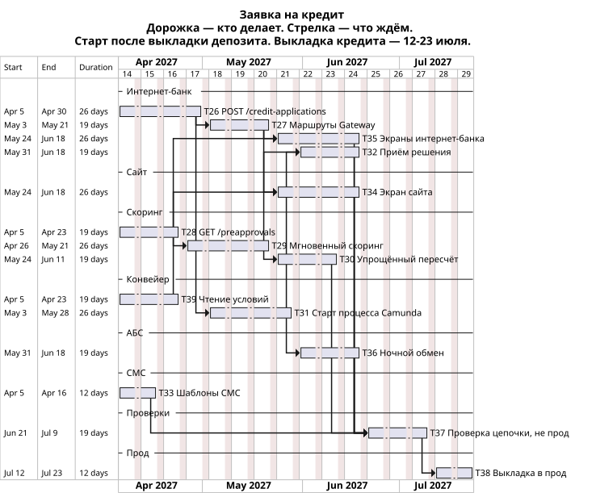

# План заявки на кредит

Горизонт — год после MVP депозита. Контур приёма из [ADR открытия депозита](../Task3/ADR.md) уже стоит, этот план его не переоткрывает. Номера продолжают [задачи передачи ставок](../Task4/tasks.md): последняя там — T25. Системы и вызовы — в [ADR заявки на кредит](ADR.md).

Кредит стартует после выкладки депозита (T17, 22 марта–2 апреля 2027) и на пути «заявка принята» депозита не стоит. Старт плана: 5 апреля 2027. Выкладка кредита: 12–23 июля 2027. Год после MVP тянется до начала апреля 2028, календарь до этой даты не растягиваем.

## Этапы

1. **Апрель 2027.** Приём кредита в уже существующем сервисе заявок, шаблоны СМС, чтение уже посчитанного предодобрения, чтение условий продукта для витрины. Экраны этого не ждут. Старт процесса Camunda к витрине не относится.
2. **Май 2027.** Маршруты Gateway, мгновенный скоринг только по бюро, онлайн-старт процесса Camunda.
3. **Май–июнь 2027.** Экраны сайта и интернет-банка, приём решения после accepted, упрощённый пересчёт, ночной обмен по тому же applicationId.
4. **Конец июня – июль 2027.** Интеграционная проверка цепочки с 21 июня по 9 июля и выкладка 12–23 июля. Экран сайта к этому моменту уже стоит: он ждёт маршруты Gateway и чтение условий, не старт Camunda.

## Задачи

| Номер | Задача | Система | Команда |
| --- | --- | --- | --- |
| T26 | POST /credit-applications в сервисе заявок: applicationId, Idempotency-Key, ответ accepted до старта Camunda | Заявка | Интернет-банк |
| T27 | Маршруты Gateway. Сайт без профиля. GET /rates кредита без clientId и на сайте, и в интернет-банке. clientId из профиля — только в GET /preapprovals, коде и заявке интернет-банка | Интернет-банк | Интернет-банк |
| T28 | GET /preapprovals: уже посчитанная сумма, нового прогона нет | Скоринг | IT банка |
| T29 | Мгновенный скоринг заявки с сайта: только БКИ, в АБС не ходит | Скоринг | IT банка |
| T30 | Упрощённый пересчёт, только если данные клиента изменились. В БКИ не ходит: прошлый ответ бюро или пересчёт по нему. Нет вчерашней выгрузки или ответа бюро — день не обещаем | Скоринг | IT банка |
| T39 | Чтение условий продукта для витрины сайта. Не старт процесса и не Oracle АБС | Конвейер | Подрядчик внедрения и IT банка |
| T31 | Онлайн-старт процесса Camunda по applicationId. Статус отсюда не отдаётся. Условия витрины сюда не входят | Конвейер | Подрядчик внедрения и IT банка |
| T32 | После accepted сервис заявок стартует процесс. Заявку без отметки старта повторяет сам. Статус принимает и повторяет по applicationId | Заявка | Интернет-банк |
| T33 | Шаблоны credit_branch, credit_rejected, credit_status на уже существующем шлюзе | СМС-шлюз | IT-отдел |
| T34 | Экран сайта: базовый тариф кредита из GET /rates без clientId, условия отдельным чтением конвейера, форма без кода | Сайт | Команда сайта банка |
| T35 | Экраны интернет-банка: список по базовому тарифу без clientId, предодобрение, форма с кодом и счётом | Интернет-банк | Интернет-банк |
| T36 | Ночной обмен сходится по applicationId, в том числе без одобрения. Чаще раза в сутки не ходит. Новую заявку в АБС создают, только если обмен этот applicationId не принёс | АБС | АБС |
| T37 | Интеграционная проверка цепочки: заявка, повтор старта, скоринг, БКИ, повтор статуса, СМС и ночной обмен по applicationId. Вторая заявка в отделении не создаётся, если обмен уже принёс этот идентификатор | Заявка, конвейер, скоринг, СМС-шлюз, АБС | Интернет-банк, конвейер, скоринг и АБС |
| T38 | Выкладка в прод: приём кредита, маршруты, экраны, скоринг, старт процесса, чтение условий, шаблоны СМС и ночной обмен. Клиент отправляет боевую заявку с сайта и из интернет-банка | Канал, заявка, скоринг, конвейер, АБС | Интернет-банк, сайт, скоринг, конвейер и АБС |

Скоринг (T28–T30) пишут сотрудники IT банка. Конвейер в T31 и T39 делят подрядчик внедрения и IT банка. Ядро интернет-банка и СМС внутри ядра подрядчику не отдаём: шаблоны T33 остаются на шлюзе IT-отдела. Команда интернет-банка — те же 10 человек, что ведут сервис заявок.

## Кто от кого зависит

- T26 ждёт T3 и T17: приём кредита садится в сервис заявок после выкладки депозита. 5–30 апреля 2027.
- T28 ждёт T17 и стартует 5 апреля вместе с T26, T26 его не держит. До 23 апреля.
- T39 ждёт T17 и стартует 5 апреля. T26 и T31 его не держат: витрине нужен GET условий, не старт процесса. До 23 апреля.
- T33 ждёт T13: шаблоны садятся на шлюз, который уже есть. 5–16 апреля.
- T27 ждёт T5 и T26. 3–21 мая.
- T29 ждёт T28. 26 апреля – 21 мая.
- T31 ждёт T26. 3–28 мая.
- T30 ждёт T29. 24 мая – 11 июня.
- T32 ждёт T31 и T29. 31 мая – 18 июня.
- T35 ждёт T27 и T28. 24 мая – 18 июня.
- T34 ждёт T27 и T39. Старт Camunda не ждёт. 24 мая – 18 июня.
- T36 ждёт T31. 31 мая – 18 июня.
- T37 ждёт T32, T33, T34, T35, T36 и T30. Идёт 21 июня – 9 июля 2027. В прод этой задачей ничего не выкладываем.
- T38 ждёт T37. Выкладка в прод — 12–23 июля 2027.

T34, T35 и решение за день в 99,9% ответа «принята» не входят и выкладку депозита не сдвигают: они начинаются после T17.

## Роадмап

Дорожки — кто делает: интернет-банк, сайт, скоринг, конвейер, АБС, СМС. Стрелка — эту задачу не начинаем, пока не кончилась предыдущая. Суббота и воскресенье на диаграмме закрыты.

Карту систем [roadmap.drawio](../Task4/roadmap.drawio) не дополняем: кредит на неё не кладётся.
